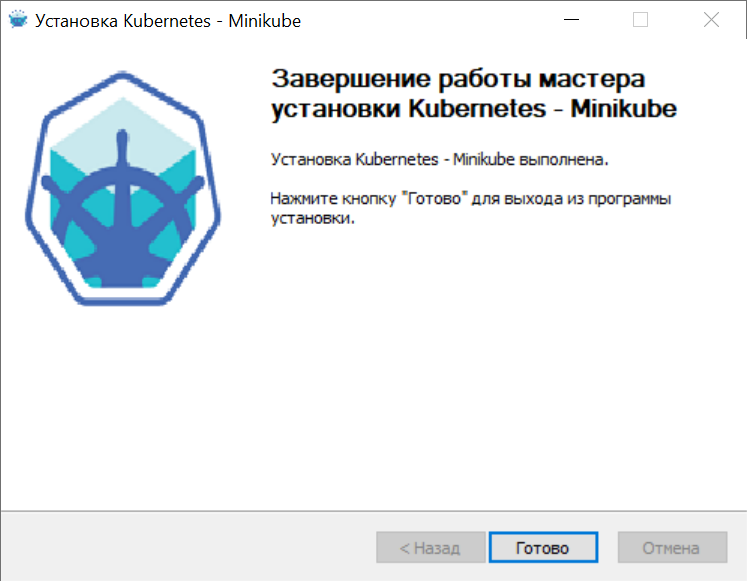

University: [ITMO University](https://itmo.ru/ru/)  
Faculty: [FICT](https://fict.itmo.ru)  
Course: [Introduction to distributed technologies](https://github.com/itmo-ict-faculty/introduction-to-distributed-technologies)  
Year: 2022/2023  
Group:  K4110c  
Author: Usacheva Daria Dmitrievna  
Lab: Lab1  
Date of create: 12.12.2022  
Date of finished: 14.12.2022   

<h1>Лабораторная работа №1 "Установка Docker и Minikube, мой первый манифест."  </h1>

Для начала проверим, поддерживается ли виртуализация  
   
<h3>Установка minikube</h3>  

Далее устанавливаем Hypervisor. В моем случае VirtualBox.  
   
 
Установка Minikube с помощью исполняемого файла установки  
   
 
Установка прошла успешно  
   
 
Чтобы убедиться в том, что гипервизор и Minikube были установлены корректно, выполним следующую команду, которая запускает локальный кластер Kubernetes:  
    
   
 
Далее выполняем команду для проверки состояния кластера:  
   

Манифест:  
   
 
Далее устанавливаем kubectl по <a href="https://storage.googleapis.com/kubernetes-release/release/v1.26.0/bin/windows/amd64/kubectl.exe">ССЫЛКЕ</a>  

 
Создаем локальный minikube кластер:  
   
 
Создаем под и сервис для доступа к контейнеру vault (указываем тип сервиса NodePort и порт 8200):  
   
 
Переходим по ссылке http://localhost:8200  
   
 
Далее входим, используя токен, найденный в логах:  
*minikube kubectl -- logs service/vault  *
  
  

 
 

