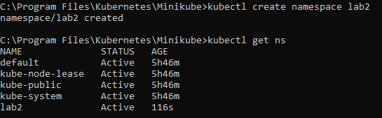
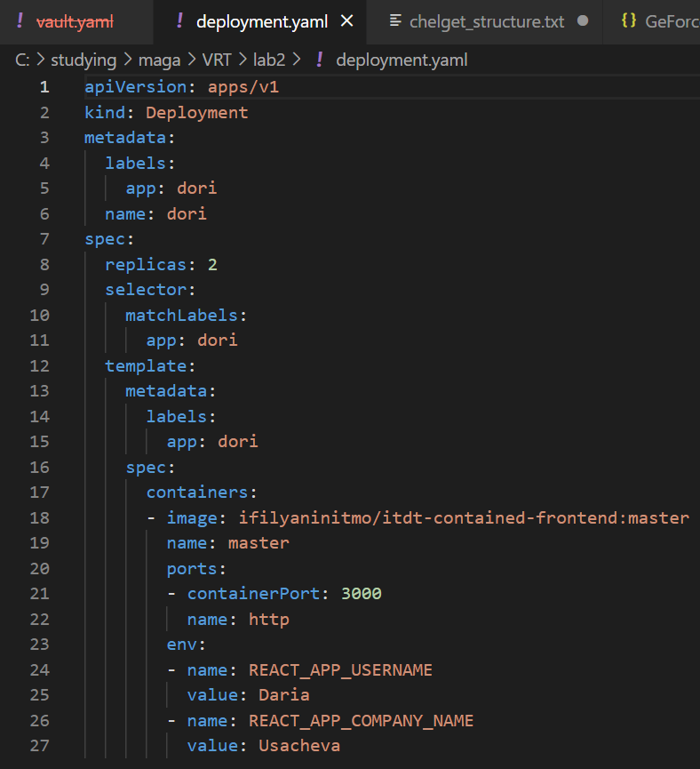
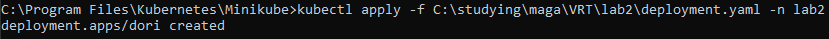
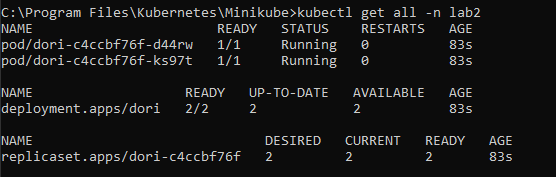
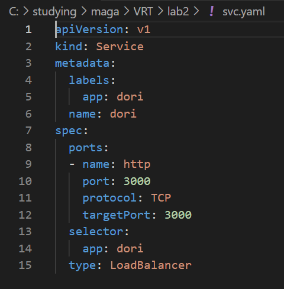
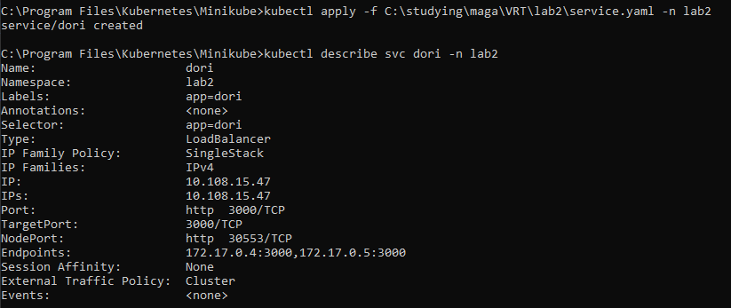
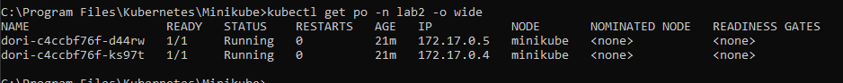
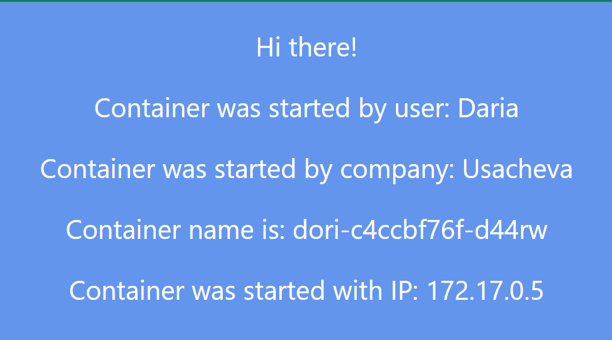
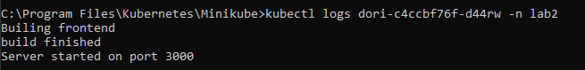
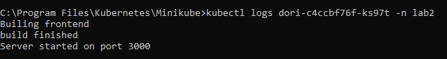

University: [ITMO University](https://itmo.ru/ru/)  
Faculty: [FICT](https://fict.itmo.ru)  
Course: [Introduction to distributed technologies](https://github.com/itmo-ict-faculty/introduction-to-distributed-technologies)  
Year: 2022/2023  
Group:  K4110c  
Author: Usacheva Daria Dmitrievna  
Lab: Lab2  
Date of create: 12.12.2022  
Date of finished: 14.12.2022   

<h1>Лабораторная работа №2 "Развертывание веб сервиса в Minikube, доступ к веб интерфейсу сервиса. Мониторинг сервиса."</h1>  

<h3>Deployment</h3>  
Создадим новый namespace lab2   

   
 
Далее создадим манифест для развертывания приложения  

  

  

Далее видно, что deployment создал новый объект, который, в свою очередь, создал необходимое количество реплик приложений.  

  

<h3>Создание сервиса</h3>  
Манифест svc.yaml для предоставления доступа к подам деплоймента:  

  
 
Создание сервиса:  

  
 
IP-адреса совпадают подов деплоймента совпадают адресами подов, на которые сервис будет проксировать трафик.  

  
 
<h3>Тестирование</h3>  
Получаем доступ к сервису.
Переходим на http://localhost:3000 и проверяем:  

  

Логи контейнеров:  

  
  
 
 

