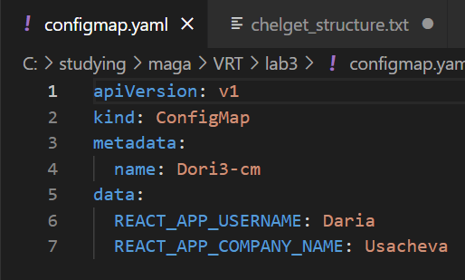
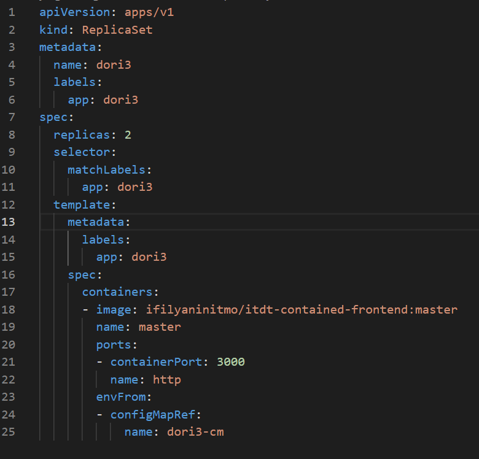
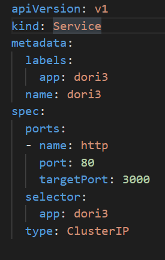
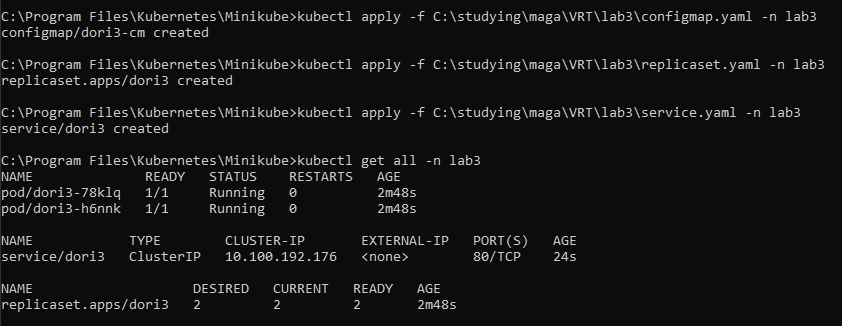
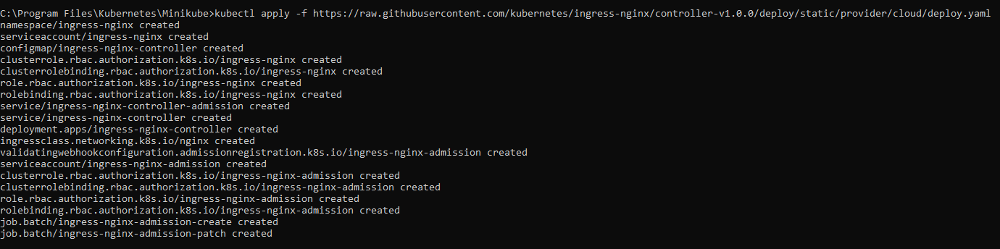
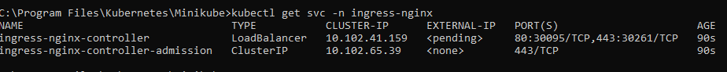
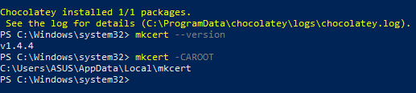
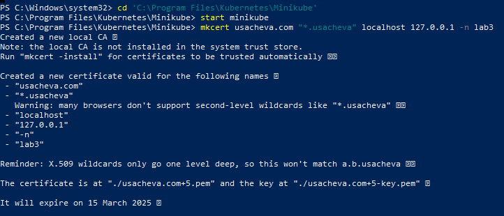
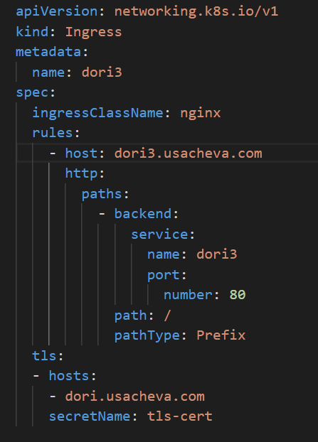
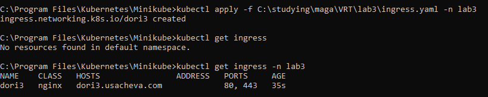

University: [ITMO University](https://itmo.ru/ru/)  
Faculty: [FICT](https://fict.itmo.ru)  
Course: [Introduction to distributed technologies](https://github.com/itmo-ict-faculty/introduction-to-distributed-technologies)  
Year: 2022/2023  
Group:  K4110c  
Author: Usacheva Daria Dmitrievna  
Lab: Lab3  
Date of create: 12.12.2022  
Date of finished: 14.12.2022   

<h1>Лабораторная работа №3 "Сертификаты и "секреты" в Minikube, безопасное хранение данных." </h1>

Создадим новый namespace lab3:  

   
 
Манифест configmap:  

   
 
Манифест для развертывания приложения:  

   
 
Манифест service.yaml для доступа к подам приложения  

   
 
Создадим ConfigMap, ReplicaSet и Service:  

   
 
<h3>Развертывание ingress-controller и создание TLS сертификата</h3>
Nginx Ingress controller:  

   
 
После развертывания в неймспейсе ingress-nginx появился сервис типа LoadBalancer - ingress-nginx-controller  

    

Перед генерацией TLS-сертификата скачаем mkcert с помощью Chocolatey:  

   
 
Генерация сертификата с помощью утилиты mkcert:  

   
 
Далее с помощью команды *kubectl create secret tls tls-cert --key key.pem --cert cert.pem -n lab3*
Импортируем TLS-сертификат в кластер как Secret.
Создаем Ingress в minikube:  

   
 
   
 
 
Чтобы приложение dori3 было доступно по FQDN на хосте, необходимо внести изменения в файл hosts, добавив следующую строку: 127.0.0.1 dori3.usacheva.com 
После этого его можно открыть по адресу https:// dori3.usacheva.com/ и увидеть интерфейс, схожий с представленным в лабораторной работе №2
