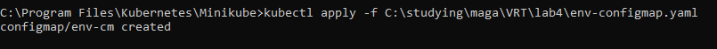
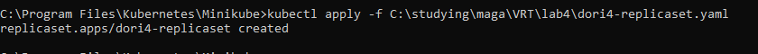

University: [ITMO University](https://itmo.ru/ru/)  
Faculty: [FICT](https://fict.itmo.ru)  
Course: [Introduction to distributed technologies](https://github.com/itmo-ict-faculty/introduction-to-distributed-technologies)  
Year: 2022/2023  
Group:  K4110c  
Author: Usacheva Daria Dmitrievna  
Lab: Lab4  
Date of create: 12.12.2022  
Date of finished: 14.12.2022   

<h1>Лабораторная работа №4 "Сети связи в Minikube, CNI и CoreDNS" </h1> 

Разворачиваем minikube cluster:

  
 
Проверим ноды:

  
 
И их статус:

  
 
Создадим calico pod:

  
 
Удаляем дефолтный pool:

  
 
Добавим label:

  
 
Манифест Ip-Pool:

  
 
Далее создадим IP-Pool

  
 
Проверяем:

  
 
Создаем configMap:

  

  
 
Создаем ReplicaSet:

  

   
 
Далее создаем сервис:

  

  

  

  
 
 
Пропингуем поды:

  
